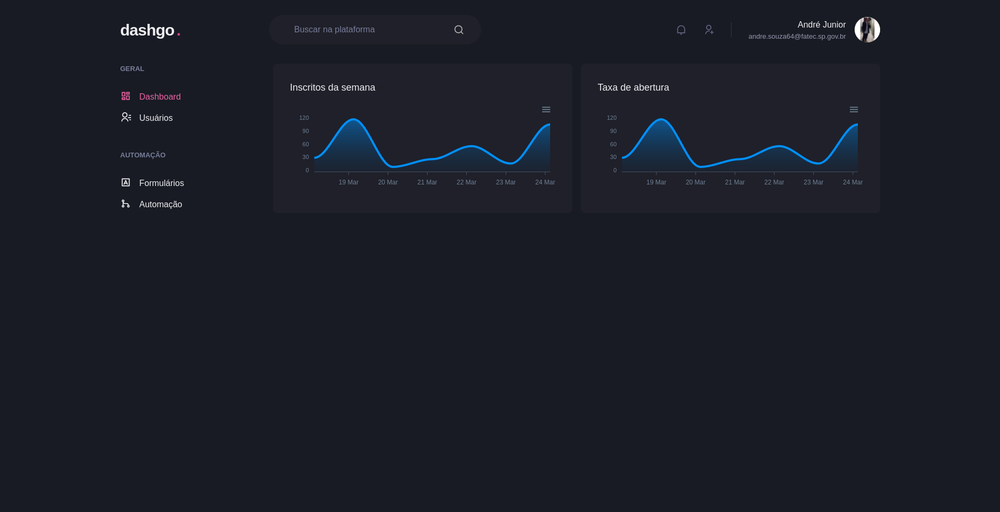
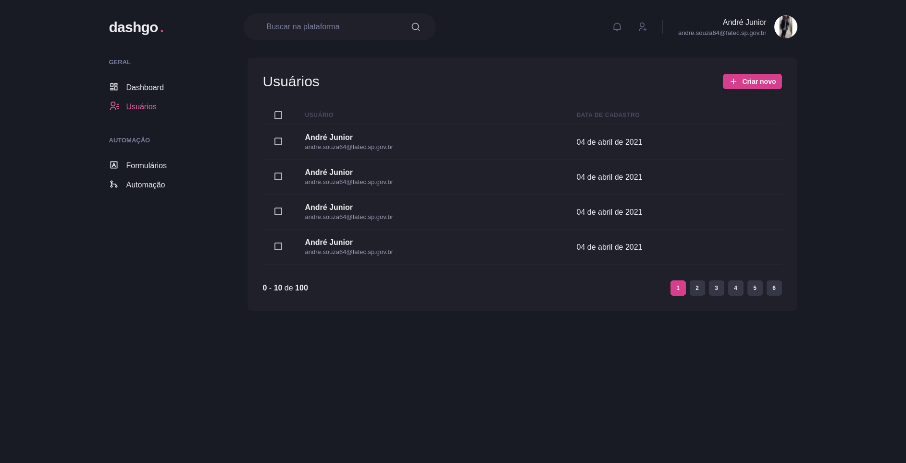

<h1 align="center" style="color: ##EEEEF2">

dashgo .

</h1>

dashgo é um exemplo de painel desenvolvido no Ignite Bootcamp da RocketSeat.

# Iniciando o projeto

Essas instruções fornecerão uma cópia do projeto completo instalado e funcionando em sua máquina local para fins de desenvolvimento e teste.

O projeto deve ser compilado com npm, então faça o download abaixo se você não tiver nenhum instalado em seu sistema.

# Configurando projeto

* Para baixar o projeto siga as instruções abaixo:

1. `https://github.com/andrejr971/dashgo.git`

2. `cd dashgo`

* Instale as dependências e inicie o servidor:

3. `yarn install`

4. `yarn dev` 🥳

# Screenshots 

* Dashboard

  

* Users List

  

***O aplicativo ainda está em desenvolvimento 🚧. Em breve este arquivo será atualizado com a implantação do aplicativo e novos recursos***

---
### Autor

---
Feito by André Junior 💙 [portifólio](https://andrejr.dev)